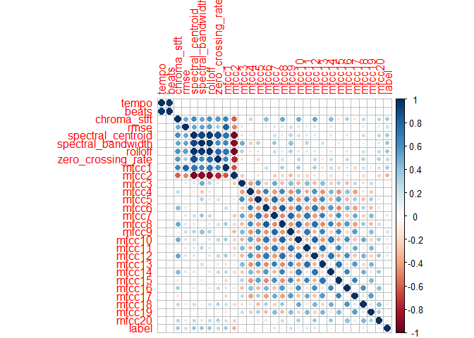
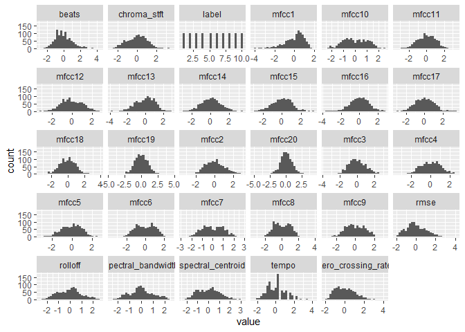
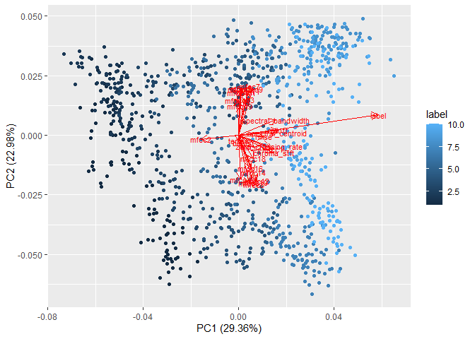
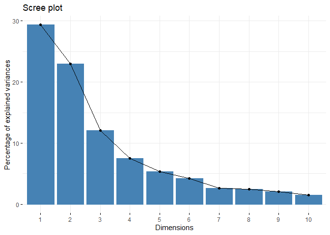

Predicting song genre
================

## Introduction

While surfing the web I stumbled upon this small sample of the [million
song dataset](http://millionsongdataset.com/), which contains features
and metadata for a million songs. I thought it would be interesting to
explore the dataset and find out if I could create a simple classifier
that could categorize the data into genres. As I do not have the
required space (\~300Gb) on my hard drive, I decided to look for a
similar, smaller dataset and found one with 1000 songs instead. This
notebook describes how I managed to create a simple classifier that
guesses the correct genre for a song with around 75% accuracy

### The dataset

The dataset consists of 1000 songs, each with 28 features and a label
(the genre). Some of the features are:

  - Tempo
  - Beats per minute
  - MFCC:s, or Mel-frequency cepstral coefficients, that are fourier
    transforms of the songs’ sound signals that are scaled and
    transformed

### Approach

For this project, I wanted to evaluate how different machine learning
models can be implemented in R and the see how I could improve the
accuracies of these models by using different parameters. The small
sample size of 1000 songs makes it harder to get a sufficient
classification rate with simple models, but in the end I managed to get
a decent accuracy by using an ensemble classifier.

## Data exploration

First of all, the data is imported and reformatted so that it can be
used for the purpose. I scaled the data to have a mean of 0 and a
standard deviation of 1.

``` r
library(caret)
```

    ## Loading required package: lattice

    ## Loading required package: ggplot2

``` r
# Load the data
raw_data = read.csv("data.csv")
```

``` r
# Visualize the dataset
head(raw_data)
```

    ##         filename     tempo beats chroma_stft      rmse spectral_centroid
    ## 1 blues.00081.au 103.35938    50   0.3802602 0.2482623          2116.943
    ## 2 blues.00022.au  95.70312    44   0.3064509 0.1134754          1156.070
    ## 3 blues.00031.au 151.99908    75   0.2534871 0.1515708          1331.074
    ## 4 blues.00012.au 184.57031    91   0.2693200 0.1190717          1361.045
    ## 5 blues.00056.au 161.49902    74   0.3910586 0.1377283          1811.076
    ## 6 blues.00058.au 107.66602    51   0.3565882 0.1620276          2068.371
    ##   spectral_bandwidth  rolloff zero_crossing_rate      mfcc1    mfcc2     mfcc3
    ## 1           1956.611 4196.108         0.12727247  -26.92978 107.3340 -46.80999
    ## 2           1497.668 2170.054         0.05861340 -233.86077 136.1702   3.28949
    ## 3           1973.643 2900.174         0.04296724 -221.80255 110.8431  18.62098
    ## 4           1567.805 2739.625         0.06912392 -207.20808 132.7992 -15.43899
    ## 5           2052.333 3927.810         0.07547951 -145.43457 102.8290 -12.51768
    ## 6           2033.930 4231.499         0.10437163  -95.43603 105.2167 -26.95301
    ##      mfcc4      mfcc5    mfcc6      mfcc7     mfcc8      mfcc9    mfcc10
    ## 1 40.93263 -21.463776 24.81627 -18.945571 15.253459 -15.050104 12.262823
    ## 2 48.93119   8.699106 13.95475   5.359449  0.381334 -13.490265 16.871769
    ## 3 30.92300   3.291330 22.58745 -20.418303 12.120995 -26.347956 -4.356270
    ## 4 60.98673   0.725807 12.43783   1.183836 -1.540779 -17.888154  8.358496
    ## 5 56.99347   2.271347 26.59140  -4.274803 17.338809  -7.985593 15.235427
    ## 6 60.83087  -4.828224 21.53847 -13.514778 12.122107 -20.233634 12.138658
    ##       mfcc11      mfcc12      mfcc13    mfcc14      mfcc15    mfcc16     mfcc17
    ## 1 -15.234050  14.3366122 -13.8217688  7.562789  -6.1813725  0.330165  -6.829571
    ## 2   5.145258  -2.2505778   3.9591978  5.322555   0.8120284 -1.107202  -4.556555
    ## 3 -26.406674 -13.0377234 -12.6522277 -1.821905  -7.2600966 -6.660252 -14.682694
    ## 4  -2.452068  -0.6132482   0.3848774  2.605128  -5.1889238 -9.527455  -9.244394
    ## 5  -6.934599   7.4572179 -10.4704440 -2.360483  -6.7836235  2.671134  -4.760879
    ## 6  -5.227018  10.2625752  -9.4381872  3.867535 -10.1874528  3.588093  -3.100753
    ##        mfcc18       mfcc19      mfcc20 label
    ## 1   0.9659217  -7.57082475   2.9189869 blues
    ## 2  -2.4364898   3.31691261  -0.6084849 blues
    ## 3 -11.7192636 -11.02521621 -13.3872601 blues
    ## 4  -2.8482738  -1.41870686  -5.9326070 blues
    ## 5  -0.9490049   0.02483205  -2.0053146 blues
    ## 6   0.1945968   0.84287183  -3.4165764 blues

``` r
# Remove filename feature
data = subset(raw_data, select = -filename )

# Scale the data to have a mean of 0 and a standard deviation of one
data[-29] = lapply(data[-29], scale)

# Store label strings in separate array and label dataframe samples by index instead (to get numeric values)
# Cast labels to factors
data.labels = sort(unique(data$label))
data = transform(data, label = match(label, data.labels))

# Data after cleaning
head(data)
```

    ##        tempo      beats chroma_stft       rmse spectral_centroid
    ## 1 -0.5739872 -0.5017670  0.01964224  1.7863019        -0.1185696
    ## 2 -0.8445512 -0.9235380 -0.88389428 -0.2657097        -1.4606427
    ## 3  1.1448902  1.2556124 -1.53224990  0.3142586        -1.2162113
    ## 4  2.2959242  2.3803352 -1.33843133 -0.1805110        -1.1743494
    ## 5  1.4806085  1.1853172  0.15183071  0.1035199        -0.5457811
    ## 6 -0.4217949 -0.4314718 -0.27013881  0.4734551        -0.1864110
    ##   spectral_bandwidth    rolloff zero_crossing_rate        mfcc1     mfcc2
    ## 1         -0.5432797 -0.2385073         0.56496988  1.172730219 0.2483669
    ## 2         -1.4152349 -1.5250789        -1.07623824 -0.891714571 1.1687142
    ## 3         -0.5109195 -1.0614426        -1.45023997 -0.771415842 0.3603634
    ## 4         -1.2819813 -1.1633934        -0.82499761 -0.625814274 1.0611221
    ## 5         -0.3614164 -0.4088804        -0.67307522 -0.009531485 0.1045843
    ## 6         -0.3963797 -0.2160333         0.01755421  0.489278426 0.1807902
    ##        mfcc3      mfcc4      mfcc5       mfcc6       mfcc7      mfcc8
    ## 1 -1.7463940  0.2783689 -1.6622670  0.85992424 -1.38970528  0.4905905
    ## 2  0.5628684  0.7582733  0.8055381 -0.05737203  1.05506479 -0.9306631
    ## 3  1.2695512 -0.3221978  0.3630957  0.67169136 -1.53784295  0.1912368
    ## 4 -0.3003933  1.4815914  0.1531950 -0.18548194  0.63505223 -1.1143497
    ## 5 -0.1657398  1.2420008  0.2796448  1.00984034  0.08598388  0.6898768
    ## 6 -0.8311155  1.4722404 -0.3012134  0.58310143 -0.84343786  0.1913430
    ##        mfcc9      mfcc10     mfcc11     mfcc12     mfcc13     mfcc14     mfcc15
    ## 1 -0.9722569  0.57099840 -1.3510639  1.4685946 -1.4624301  1.1540581 -0.4741273
    ## 2 -0.7839656  1.15161810  1.6375346 -1.0007249  1.4189831  0.7068600  0.9605862
    ## 3 -2.3360431 -1.52261980 -2.9895144 -2.6065972 -1.2729054 -0.7193253 -0.6954302
    ## 4 -1.3148436  0.07914428  0.5233969 -0.7569772  0.8397630  0.1644041 -0.2705239
    ## 5 -0.1194857  0.94547720 -0.1339605  0.4444656 -0.9193465 -0.8268369 -0.5976805
    ## 6 -1.5979712  0.55535648  0.1164540  0.8620965 -0.7520688  0.4164072 -1.2959845
    ##       mfcc16     mfcc17      mfcc18     mfcc19     mfcc20 label
    ## 1 -0.1785986 -0.6289520  0.11853418 -1.3958040  1.0459407     1
    ## 2 -0.4924951 -0.1294594 -0.76084907  1.5032832  0.1267445     1
    ## 3 -1.7051872 -2.3546663 -3.16006378 -2.3156078 -3.2031765     1
    ## 4 -2.3313358 -1.1596065 -0.86727826  0.2423257 -1.2606268     1
    ## 5  0.3326294 -0.1743594 -0.37639547  0.6266981 -0.2372445     1
    ## 6  0.5328776  0.1904515 -0.08082154  0.8445182 -0.6049941     1

By plotting the correlations as a heat map and scatter plots of each
feature, some conclusions are that:

  - There is a strong correlation between the mfcc features
  - The “non”-MFCC features are also strongly correlated with each other
  - The genre (label) is not strongly correlated with any of the other
    features
  - While some of the features appear to be normally distributed, others
    seem to have more of a beta distribution

<!-- end list -->

``` r
library(corrplot)
```

    ## corrplot 0.84 loaded

``` r
library(ggplot2)
library(tidyr)

corrplot(cor(data))
```

<!-- -->

``` r
ggplot(gather(data), aes(value)) + 
    geom_histogram(bins = ncol(data)) + 
    facet_wrap(~key, scales = 'free_x')
```

<!-- -->

To further visualize and explore the data, Principal Component Analysis
is used. Following is a summary of the calculated principal components:

``` r
data.pca = prcomp(data, retx=TRUE)
summary(data.pca)
```

    ## Importance of components:
    ##                           PC1    PC2    PC3     PC4     PC5     PC6     PC7
    ## Standard deviation     3.2625 2.8866 2.0944 1.64627 1.39369 1.24188 0.96930
    ## Proportion of Variance 0.2936 0.2298 0.1210 0.07475 0.05357 0.04254 0.02591
    ## Cumulative Proportion  0.2936 0.5234 0.6444 0.71911 0.77268 0.81522 0.84113
    ##                            PC8     PC9    PC10    PC11    PC12    PC13    PC14
    ## Standard deviation     0.94296 0.85546 0.73431 0.67186 0.62491 0.58485 0.56658
    ## Proportion of Variance 0.02452 0.02018 0.01487 0.01245 0.01077 0.00943 0.00885
    ## Cumulative Proportion  0.86565 0.88584 0.90071 0.91316 0.92393 0.93336 0.94222
    ##                           PC15   PC16    PC17    PC18    PC19    PC20    PC21
    ## Standard deviation     0.52732 0.4930 0.49010 0.46957 0.45786 0.43195 0.41090
    ## Proportion of Variance 0.00767 0.0067 0.00662 0.00608 0.00578 0.00515 0.00466
    ## Cumulative Proportion  0.94988 0.9566 0.96321 0.96929 0.97508 0.98022 0.98488
    ##                           PC22    PC23   PC24    PC25    PC26   PC27    PC28
    ## Standard deviation     0.39424 0.35927 0.3301 0.27767 0.18982 0.1700 0.10009
    ## Proportion of Variance 0.00429 0.00356 0.0030 0.00213 0.00099 0.0008 0.00028
    ## Cumulative Proportion  0.98916 0.99272 0.9957 0.99786 0.99885 0.9997 0.99992
    ##                           PC29
    ## Standard deviation     0.05290
    ## Proportion of Variance 0.00008
    ## Cumulative Proportion  1.00000

By plotting the features projected onto a 2D plane with the two first
principal components as axes, we can see that there is some separability
between the genres. Most of the MFCC features have a high variance in an
orthogonal direction to the direction in which there is a high variance
of the genre (label). Only a few features seem to covary with the genre.

``` r
library(ggfortify)
library(factoextra)
```

    ## Welcome! Want to learn more? See two factoextra-related books at https://goo.gl/ve3WBa

``` r
# Plot the PCA, showing eigenvectors of the result
autoplot(data.pca, data=data, loadings=TRUE, colour="label", loadings.label=TRUE, loadings.label.size=3)
```

    ## Warning: `select_()` is deprecated as of dplyr 0.7.0.
    ## Please use `select()` instead.
    ## This warning is displayed once every 8 hours.
    ## Call `lifecycle::last_warnings()` to see where this warning was generated.

<!-- -->

``` r
fviz_eig(data.pca)
```

<!-- --> To
prepare the data for training and testing on some classifiers, it is
partitioned into two sets, one for training and one for testing.

``` r
# Split into training and validation data, with uniform distribution among labels
training_indices = createDataPartition(data$label, p=0.75, list=FALSE)

data.train = data[training_indices,]
data.test = data[-training_indices,]
```

## Some different classifiers

Following are some implementations and evaluations of different
classifiers.

A helper function to calculate the accuracy given a confusion matrix.

``` r
library(psych)
```

    ## 
    ## Attaching package: 'psych'

    ## The following objects are masked from 'package:ggplot2':
    ## 
    ##     %+%, alpha

``` r
calc_accuracy = function(cmatr) {
  return(tr(cmatr)/sum(cmatr))
}
```

### Linear Discriminant Analysis

As the plot from the Principal Component Analysis suggests, the
different labels seem to form clusters to some extent. Thus, classifiers
using Linear Discriminant Analysis could be efficient. Below is a simple
classifier using standard LDA, which assumes that the features are
normally distributed and have identical covariance matrices.

``` r
library(MASS)
data.lda = lda(label ~ ., data=data.train)
data.lda.predictions = predict(data.lda, data.test)

data.lda.table = table(as.numeric(data.lda.predictions$class), data.test$label)
data.lda.table
```

    ##     
    ##       1  2  3  4  5  6  7  8  9 10
    ##   1  15  0  1  1  0  0  1  0  1  1
    ##   2   0 20  0  0  0  2  0  1  0  0
    ##   3   1  2  9  1  0  2  0  1  3  1
    ##   4   0  0  2 11  2  0  0  2  0  1
    ##   5   0  0  0  2 12  1  1  2  5  0
    ##   6   4  0  2  0  0 17  0  0  0  2
    ##   7   1  0  0  2  1  0 20  0  1  2
    ##   8   0  0  0  0  0  0  0 22  1  0
    ##   9   0  0  2  2  6  0  0  0 14  1
    ##   10 10  0  6  6  4  1  2  0  3 14

``` r
mean(data.lda.predictions$class==data.test$label)
```

    ## [1] 0.616

As we could see from the data exploration, some of the features do not
seem to be normally distributed and they do not have similar covariance
matrices. This could explain why this classifier only gets \~60%
accuracy.

Below are some implementations of other Discriminant Analysis Models:

  - Quadratic Discriminant Analysis (QDA), does not assume equal
    covariance matrices
  - Mixture Discriminant Analysis (MDA), in which each class is assumed
    to be a Gaussian mix of subclasses
  - Flexible Disriminant Analysis (FDA), uses nin-linear combinations of
    features
  - RDA, works well when there are a large amount of features compared
    to samples in the dataset

<!-- end list -->

``` r
data.qda = qda(label~., data=data.train)
data.qda.predictions = predict(data.qda, data.test)

data.qda.table = table(as.numeric(data.qda.predictions$class), data.test$label)
data.qda.table
```

    ##     
    ##       1  2  3  4  5  6  7  8  9 10
    ##   1  22  1  3  1  1  0  3  0  2  2
    ##   2   0 19  0  0  0  2  0  0  0  0
    ##   3   3  0  9  1  0  2  0  1  3  0
    ##   4   1  0  2 15  1  0  1  2  1  1
    ##   5   0  0  0  0 13  0  1  1  5  0
    ##   6   2  1  3  1  0 13  0  0  1  1
    ##   7   0  0  0  1  1  0 18  0  0  2
    ##   8   0  0  0  3  0  2  0 23  1  0
    ##   9   0  1  2  1  6  4  0  0 13  3
    ##   10  3  0  3  2  3  0  1  1  2 13

``` r
mean(data.qda.predictions$class==data.test$label)
```

    ## [1] 0.632

``` r
library(mda)
```

    ## Loading required package: class

    ## Loaded mda 0.5-2

``` r
data.mda = mda(label~., data=data.train)
data.mda.predictions = predict(data.mda, data.test)

data.mda.table = table(as.numeric(data.mda.predictions), data.test$label)
data.mda.table
```

    ##     
    ##       1  2  3  4  5  6  7  8  9 10
    ##   1  16  0  1  1  0  0  0  0  0  2
    ##   2   0 20  0  0  0  3  0  0  0  0
    ##   3   5  2 11  1  0  3  0  1  1  0
    ##   4   0  0  2 12  1  0  3  2  2  0
    ##   5   1  0  0  1 13  1  1  0  5  0
    ##   6   2  0  3  0  0 15  0  0  0  2
    ##   7   1  0  0  1  1  0 19  0  0  0
    ##   8   0  0  1  3  0  0  0 24  3  0
    ##   9   1  0  0  2  6  0  0  1 13  2
    ##   10  5  0  4  4  4  1  1  0  4 16

``` r
mean(data.mda.predictions==data.test$label)
```

    ## [1] 0.636

``` r
data.fda = mda(label~., data=data.train, method=polyreg)
data.fda.predictions = predict(data.fda, data.test)

data.fda.table = table(as.numeric(data.lda.predictions$class), data.test$label)
data.fda.table
```

    ##     
    ##       1  2  3  4  5  6  7  8  9 10
    ##   1  15  0  1  1  0  0  1  0  1  1
    ##   2   0 20  0  0  0  2  0  1  0  0
    ##   3   1  2  9  1  0  2  0  1  3  1
    ##   4   0  0  2 11  2  0  0  2  0  1
    ##   5   0  0  0  2 12  1  1  2  5  0
    ##   6   4  0  2  0  0 17  0  0  0  2
    ##   7   1  0  0  2  1  0 20  0  1  2
    ##   8   0  0  0  0  0  0  0 22  1  0
    ##   9   0  0  2  2  6  0  0  0 14  1
    ##   10 10  0  6  6  4  1  2  0  3 14

``` r
mean(data.fda.predictions==data.test$label)
```

    ## [1] 0.648

``` r
library(klaR)

data.rda = rda(label~., data=data.train)
data.rda.predictions = predict(data.rda, data.test)

data.rda.table = table(as.numeric(data.rda.predictions$class), data.test$label)
data.rda.table
```

    ##     
    ##       1  2  3  4  5  6  7  8  9 10
    ##   1  22  2  3  0  0  0  2  0  0  2
    ##   2   0 20  0  0  0  3  0  0  0  0
    ##   3   4  0  9  1  1  3  0  1  4  0
    ##   4   0  0  2 15  2  0  0  2  1  1
    ##   5   0  0  0  2 15  0  1  2  5  0
    ##   6   1  0  2  0  0 16  0  0  0  1
    ##   7   2  0  0  3  1  0 21  0  0  1
    ##   8   0  0  0  2  0  0  0 22  1  0
    ##   9   0  0  1  0  4  1  0  0 14  2
    ##   10  2  0  5  2  2  0  0  1  3 15

``` r
mean(data.rda.predictions$class==data.test$label)
```

    ## [1] 0.676

While none of these classifiers have an astounding accuracy, the RDA
classifier achieves an accuracy of \~70%. Noteworthy is that different
classifiers have some classes which they are better than others at
predicting.

### K-nearest neighbors

``` r
library(kknn)
```

    ## 
    ## Attaching package: 'kknn'

    ## The following object is masked from 'package:caret':
    ## 
    ##     contr.dummy

``` r
neighbors_to_test = ceiling(sqrt(dim(data.train)[1]))
data.knn = train.kknn(as.factor(label) ~ ., data.train, kmax=neighbors_to_test, distance=2, kernel='gaussian')
data.knn.predictions = predict(data.knn, data.test)

data.knn.table = table(data.knn.predictions, data.test$label)
data.knn.table
```

    ##                     
    ## data.knn.predictions  1  2  3  4  5  6  7  8  9 10
    ##                   1  17  0  1  0  1  0  3  0  0  1
    ##                   2   1 19  0  0  0  4  0  0  1  0
    ##                   3   2  2 13  2  4  5  0  2  2  1
    ##                   4   2  0  0 14  2  1  1  0  2  2
    ##                   5   2  0  2  4 12  1  2  0  2  0
    ##                   6   2  1  2  0  0  9  0  2  1  2
    ##                   7   2  0  0  0  2  0 18  0  0  2
    ##                   8   0  0  0  1  1  0  0 23  3  2
    ##                   9   1  0  2  1  2  0  0  0 13  2
    ##                   10  2  0  2  3  1  3  0  1  4 10

``` r
calc_accuracy(data.knn.table)
```

    ## [1] 0.592

K-nearest neighbors seem to perform well, but does not achieve the same
accuracy as some of the LDA models.

### Multinomial Logistic Regression

``` r
library(nnet)

data.log = multinom(as.factor(label) ~ ., data=data.train)
```

    ## # weights:  300 (261 variable)
    ## initial  value 1726.938820 
    ## iter  10 value 984.970915
    ## iter  20 value 787.942670
    ## iter  30 value 693.233236
    ## iter  40 value 601.603419
    ## iter  50 value 569.344049
    ## iter  60 value 543.085671
    ## iter  70 value 533.183544
    ## iter  80 value 529.244242
    ## iter  90 value 523.814979
    ## iter 100 value 519.988712
    ## final  value 519.988712 
    ## stopped after 100 iterations

``` r
data.log.predictions = predict(data.log, data.test)

data.log.table = table(data.log.predictions, data.test$label)
data.log.table
```

    ##                     
    ## data.log.predictions  1  2  3  4  5  6  7  8  9 10
    ##                   1  19  0  3  1  0  2  1  0  1  1
    ##                   2   1 20  0  0  1  2  0  1  1  1
    ##                   3   1  1  7  1  0  3  0  0  2  1
    ##                   4   0  0  1 11  3  0  0  1  1  0
    ##                   5   0  0  0  2 10  0  1  1  4  0
    ##                   6   2  1  2  0  0 14  0  2  0  2
    ##                   7   2  0  1  0  1  0 22  0  0  1
    ##                   8   0  0  0  1  1  0  0 22  3  1
    ##                   9   0  0  1  3  8  1  0  1 14  2
    ##                   10  6  0  7  6  1  1  0  0  2 13

``` r
calc_accuracy(data.log.table)
```

    ## [1] 0.608

Multinomial Logistic Regression uses a multinomial link, which is
suitable for our dataset since we have 10 classes. Still, the accuracy
is not better than the LDA models.

### Support Vector Machines

``` r
library(e1071)

# SVM with regular, rectangular kernel
data.svm = svm(as.factor(label) ~ ., data.train, type='C-classification', kernel='linear')
data.svm.predictions = predict(data.svm, data.test)
data.svm.table = table(data.svm.predictions, data.test$label)
calc_accuracy(data.svm.table)
```

    ## [1] 0.648

### Kernel Support Vector Machines

The kernel support vector machines use the kernel trick to implicitly
map their decision boundaries to the non-linear space. Here, three
different kernel methods are used.

``` r
library(kernlab)
```

    ## 
    ## Attaching package: 'kernlab'

    ## The following object is masked from 'package:psych':
    ## 
    ##     alpha

    ## The following object is masked from 'package:ggplot2':
    ## 
    ##     alpha

``` r
# SVM with radial kernel
data.ksvm.1= ksvm(as.factor(label) ~ ., data.train, type="nu-svc", kernel='rbfdot')
data.ksvm.1.predictions = predict(data.ksvm.1, data.test)
data.ksvm.1.table = table(data.ksvm.1.predictions, data.test$label)
calc_accuracy(data.ksvm.1.table)
```

    ## [1] 0.68

``` r
data.ksvm.2 = ksvm(as.factor(label) ~ ., data.train, type="nu-svc", kernel='laplacedot')
data.ksvm.2.predictions = predict(data.ksvm.2, data.test)
data.ksvm.2.table = table(data.ksvm.2.predictions, data.test$label)
calc_accuracy(data.ksvm.2.table)
```

    ## [1] 0.696

``` r
data.ksvm.3 = ksvm(as.factor(label) ~ ., data.train, type="spoc-svc", kernel='rbfdot')
data.ksvm.3.predictions = predict(data.ksvm.3, data.test)
data.ksvm.3.table = table(data.ksvm.3.predictions, data.test$label)
calc_accuracy(data.ksvm.3.table)
```

    ## [1] 0.664

The kernelized support vector machines achieve an accuracy of around
70%.

## Ensemble of classifiers

Now, a large amount of different models have been fit to the dataset.
Among these, the top performers have been the kernelized support vector
machines and the RDA and MDA disciminant analyses, with accuracies
around 70%. The goal in this last part is to create an ensemble of these
classifiers to improve the accuracy even more. First, some helper
functions are created.

``` r
# Take a list of classifiers and a dataset and return a list of the model's predictions
all_predictions = function(classifiers, data) {
  all_preds = data.frame(matrix(NA, nrow=nrow(data), ncol=length(classifiers)))

  for(i in 1:length(classifiers)) {
    prediction = predict(classifiers[[i]], data)
    if(class(prediction) != "factor") {
      prediction = as.factor(prediction$class)
    }
    all_preds[, i] = (prediction)
  }
  return(all_preds)
}

# Select the most likely class by calculating the "likelihood" for each class according to different model's accuracies
weighted_predictions = function(separate_predictions, weights) {
  res = apply(separate_predictions, 1, function(x) {
    
    score_per_class = replicate(10, 0)
    for(classifier in 1:length(x)) {
      score_per_class[as.numeric(x[classifier])] = score_per_class[as.numeric(x[classifier])] + weights[classifier, as.numeric(x[classifier])]
    }
    x = which.max(score_per_class)
  })
  return(res)
}

# Take a confusion matrix and calculate the likelihood that the actual class is the predicted one
# P(class is correct | class = A) = #times the classifier guessed A correctly / #times the classifier guessed A
calc_accuracy_per_class = function(cmatr) {
  n = dim(cmatr)[1]
  weights = numeric(n)
  
  for(i in 1:n) {
    weights[i] = cmatr[i, i]/sum(cmatr[i,])
  }
  return(weights)
}

# Take a list of classifiers and data and computes the accuracies (weights) per class for all classifiers
calc_weights_with_data = function(classifiers, data) {
  predictions = all_predictions(classifiers, data)
  tables = lapply(predictions, function(x) table(x, data$label))
  accuracies = lapply(tables, calc_accuracy_per_class)
  weights = matrix(unlist(accuracies), ncol=10, byrow=TRUE)
  return(weights)
}
```

The classifiers perform differently on different classes, so
theoretically, a combined classifier should perform better. By combining
the three Support Vector Machine models and two Discriminant Analysis
Models, the accuracy increases by a few percentage points. The
“combined” ensemble model uses weighted classifications from each
model to decide which genre to classify each song as.

``` r
classifiers = list(data.rda, data.mda, data.ksvm.1, data.ksvm.2, data.ksvm.3)
weights = calc_weights_with_data(classifiers, data.test)
all_testpred = all_predictions(classifiers, data.test)
weights
```

    ##           [,1]      [,2]      [,3]      [,4]      [,5]      [,6]      [,7]
    ## [1,] 0.7096774 0.8695652 0.3913043 0.6521739 0.6000000 0.8000000 0.7500000
    ## [2,] 0.8000000 0.8695652 0.4583333 0.5454545 0.5909091 0.6818182 0.8636364
    ## [3,] 0.6666667 0.9047619 0.5000000 0.5517241 0.6818182 0.7083333 0.8076923
    ## [4,] 0.7666667 0.8260870 0.5789474 0.6000000 0.6363636 0.7916667 0.8076923
    ## [5,] 0.8095238 0.6785714 0.6363636 0.5909091 0.5769231 0.6666667 0.6774194
    ##           [,8]      [,9]     [,10]
    ## [1,] 0.8800000 0.6363636 0.5000000
    ## [2,] 0.7741935 0.5200000 0.4102564
    ## [3,] 0.8846154 0.7391304 0.3750000
    ## [4,] 0.8928571 0.6000000 0.4285714
    ## [5,] 0.8000000 0.6296296 0.5263158

``` r
ensemble_testpred = weighted_predictions(all_testpred, weights)

ensemble_table = table(as.numeric(ensemble_testpred), data.test$label)
ensemble_table
```

    ##     
    ##       1  2  3  4  5  6  7  8  9 10
    ##   1  22  0  3  0  0  0  1  0  0  2
    ##   2   0 19  0  0  0  2  0  0  0  0
    ##   3   2  2 12  1  0  2  0  0  3  0
    ##   4   0  0  2 16  2  0  1  2  1  2
    ##   5   0  0  0  2 16  0  1  1  4  0
    ##   6   2  1  2  0  0 19  0  0  1  1
    ##   7   2  0  0  2  2  0 21  0  0  1
    ##   8   0  0  0  1  0  0  0 25  2  0
    ##   9   1  0  1  1  3  0  0  0 16  4
    ##   10  2  0  2  2  2  0  0  0  1 12

``` r
calc_accuracy(ensemble_table)
```

    ## [1] 0.712

## Summary

This project proved that ensemble methods can be an easy way to improve
the accuracy of any model. It does however come with a cost: the
combined model requires more memory, time and computation. While I am
fairly satisfied with this model’s performance, it could be improved on
in many ways:

  - A neural network could be used for the combined classifier, instead
    of the “maximum weighted voting” approach
  - A boosting method could be used where the training samples are
    weighted according to previous models performance
  - Posteriors from each model could be used instead of the calculated
    “weights” and binary features that were used in this ensemble
    model.
